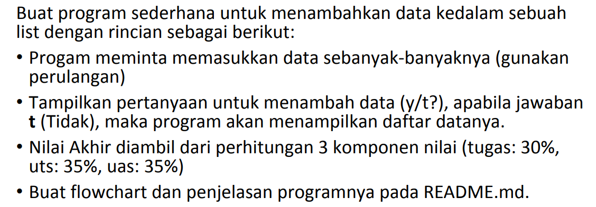
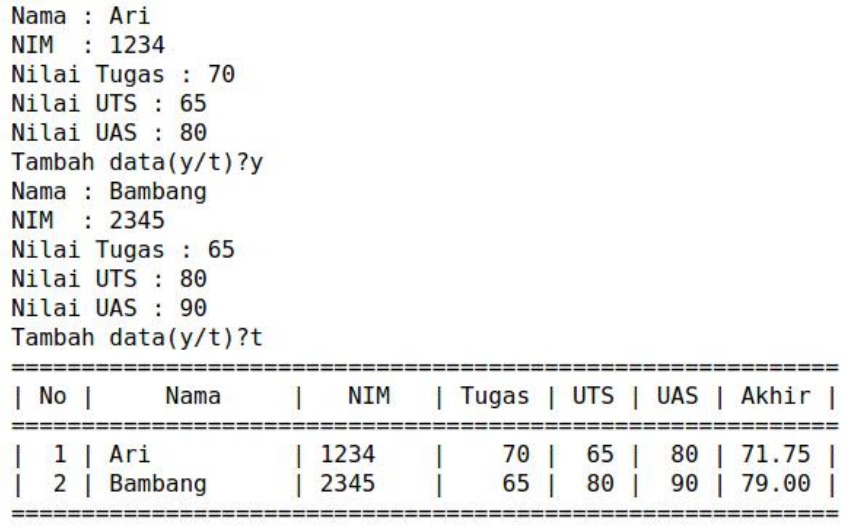
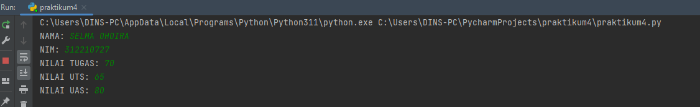
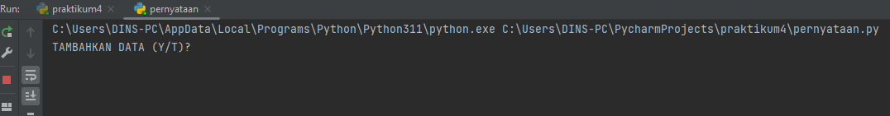
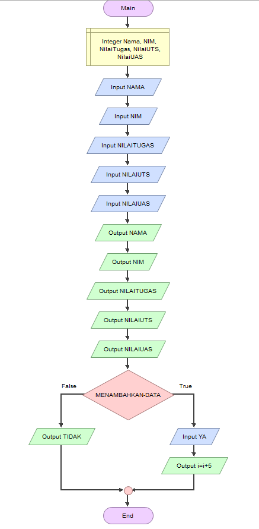

# PERTEMUAN 9

NAMA : Selma Ohoira

NIM : 312210727

KELAS : TI.22.C9

Mata Kuliah : Bahasa Pemograman

# TUGAS PRAKTIKUM 4
Soal

Dengan hasil outpunya sbb:

Disini diminta untuk memasukan data sebanyak-banyaknya. Jadi saya akan mencoba memasukan beberapa data diantaranya seperti NAMA, NIM, NILAI TUGAS, NILAI UTS dan NILAI UAS

Untuk dapat menambahkan data-data tersebut, masukan code seperti ini:

    nama = input("NAMA: ")
    nim = input("NIM: ")
    tugas = int(input("NILAI TUGAS: "))
    uts = int(input("NILAI UTS: "))
    uas = int(input("NILAI UAS: "))

Setelah itu run, hasil outputnya seperti ini:

Selanjutnya diminta untuk membuat sebuah pernyataan YA/TIDAK pada pertanyaan 'apakah ingin menambahkan sebuah data?'.
Masukkan code berikut:

    if (input("TAMBAHKAN DATA (Y/T)?") == ''):
    ulang = False

Setelah itu run, hasil outputnya seperti ini:

Selanjutnya masukan code berikut:

    nilai = []
    ulang = True

    while ulang:
        nama = input("Masukkan Nama: ")
        nim = input("Masukkan NIM: ")
        tugas = int(input("Masukkan Nilai Tugas: "))
        uts = int(input("Masukkan Nilai UTS: "))
        uas = int(input("Masukkan Nilai UAS: "))
        akhir = (tugas * 30/100) + (uts * 35/100) + (uas * 35/100)

        nilai.append([nama, nim, tugas, uts, uas, int(akhir)])
        if (input("Tambah data (y/t)?") == 't'):
            ulang = False

    print("\n                      Daftar Nilai Mahasiswa")
    print("==================================================================")
    print("|No. |     Nama     |    NIM    | Tugas |  UTS  |  UAS  |  Akhir |")
    print("==================================================================")
    i = 0
    for item in nilai:
        i += 1
        print("| {no:2d} | {nama:12s} | {nim:9s} | {tugas:5d} | {uts:5d} | {uas:5d} | {akhir:6.2f} |"
            .format(no=i, nama=item[0], nim=item[1], tugas=item[2], uts=item[3], uas=item[4], akhir=item[5]))
    print("==================================================================")

# HASIL OUTPUT

# FLOWCHART PROGRAM

SELESAI!!