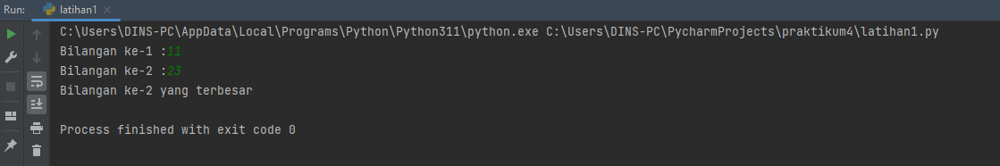
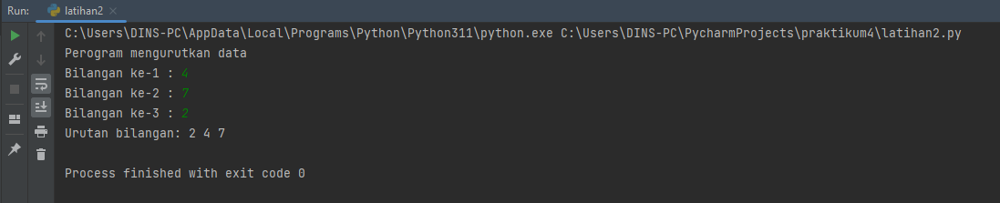
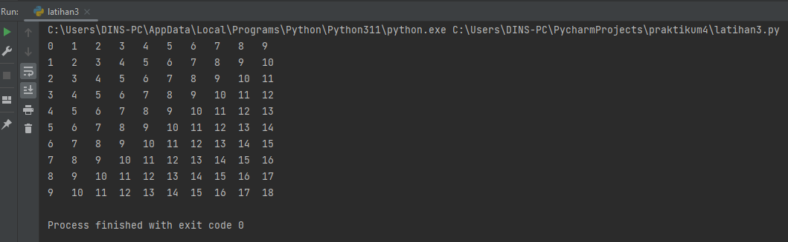
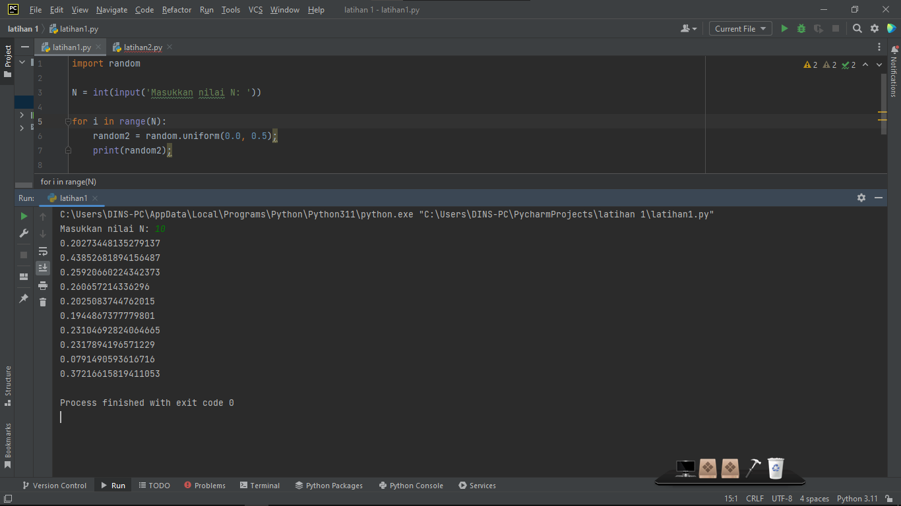

# PRAKTIKUM 4

NAMA : Selma Ohoira

NIM : 312210727

KELAS : TI.22.C9

Mata Kuliah : Bahasa Pemograman

## Latihan 1
Membuat program sederhana dengan input 2 buah bilangan, kemudian tentukan bilangan terbesar
dari kedua bilangan tersebut menggunakan statement if.
Masukan syntax berikut:

    # input nilai variable
    a = input("Bilangan ke-1 :")
    b = input("Bilangan ke-2 :")

    # jika bilangan ke 1 lebih besar 
    if a > b :
        print("Bilangan ke-1 yang terbesar")

    # jika bilangan ke 2 lebih besar
    elif b > a :
        print("Bilangan ke-2 yang terbesar")

    # jika bilangan ke 1 ke 2 sama besar
    else:
        print("Bilangan ke-1 dan ke-2 sama besarnya")

Hasil output Latihan 1

## Latihan 2
Membuat program untuk mengurutkan data berdasarkan input sejumlah data dengan
tampilkan hasilnya secara berurutan mulai dari data terkecil.
Masukan syntax berikut:

    # menampilkan karakter
    print("Perogram mengurutkan data")
    # input nilai variable
    a = input("Bilangan ke-1 : ")
    b = input("Bilangan ke-2 : ")
    c = input("Bilangan ke-3 : ")

    if a<b and a<c:
        if b<c:
                print("Urutan bilangan:", a, b, c)
        else:
                print("Urutan bilangan:", a, c, b)
    elif b<a and b<c:
        if a<c:
                print("Urutan bilangan:", b, a, c)
        else:
                print("Urutan bilangan:", b, c, a)
    else:
        if a<b:
                print("Urutan bilangan:", c, a, b)
        else:
                print("Urutan bilangan:", c, b, a)

Hasil output latihan 2

## Latihan 3
Membuat program dengan perulangan bertingkat (nested) for.
Masukan syntax berikut:

    # melakukan pengulangan 0-9
    for i in range(0,10):
    # melakukan pengulangan 0-9
        for j in range(0,10):
    # menampilkan hasil dari i+j dengan rata kiri di posisi 3
            print('{0:<3}'.format(i+j), end=' ')
    # menampilkan garis ganti/membuat garis baru
        print()

Hasil output latihan3

## Latihan 4
Program untuk menampilkan N bilangan acak kurang dari 0,5.

Import Random.

    import random;

Masukan nilai N.

    N = int(input('Masukkan nilai N: '));

Looping nilai N menggunakan For.

    for i in range(N)

Random dengan random.uniform dengan range 0.0 - 0.5.

    random2 = random.uniform(0.0, 0.5);

Print hasil random.

    print(random2);

## Hasil output latihan1.py

SELESAI !!